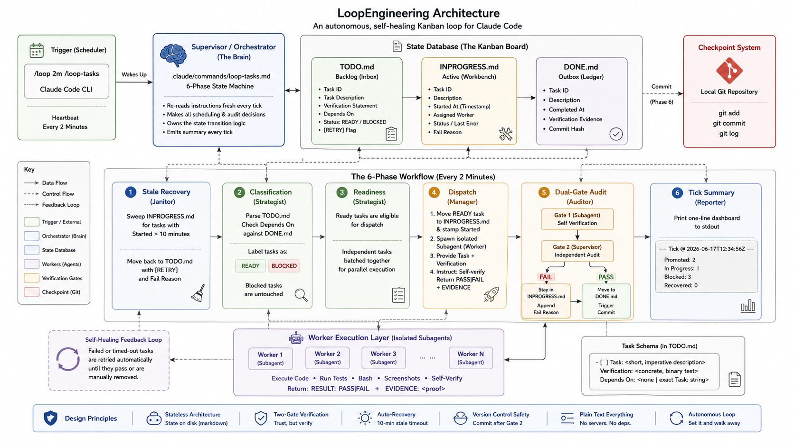

# Loop Engineering Claude Code Kanban Plugin


An autonomous, self-healing Kanban loop for Claude Code. Drop tasks in markdown. Walk away. Watch verified work commit itself to git.
```
   ┌─────────────┐    ┌──────────────┐    ┌─────────────┐
   │   TODO.md   │ -> │ INPROGRESS   │ -> │   DONE.md   │
   │  backlog    │    │  + timer     │    │ + git comm. │
   └─────────────┘    └──────────────┘    └─────────────┘
           ^                  |                  |
           |    10m stale     |    Gate 1 + 2    |
           +------------------+------------------+
                  (auto-retry)        (auto-verify)
```

---

## About

**LoopEngineering is a Claude Code plugin that turns `/loop` into an autonomous, self-healing task supervisor.**

Drop a list of tasks into `TODO.md` — each with a description, a verification statement, and its dependencies — then run:

```
/loop 2m /loop-tasks
```

…and walk away. The plugin wakes up every 2 minutes, dispatches ready tasks to isolated subagents, verifies their work through two independent gates, commits verified tasks to git, and recovers automatically from any subagent that crashes or hangs.

**What you get out of the box:**

- A custom slash command (`/loop-tasks`) that runs the 6-phase supervisor
- A strict markdown task schema (Task / Verification / Depends On)
- A 3-file Kanban board on disk (TODO / INPROGRESS / DONE) — fully recoverable
- A 10-minute stale-task recovery system — no more stuck queues
- A dual-gate verification protocol — subagent self-check + supervisor re-check
- Automatic git commits per verified task — your `git log` becomes the audit trail

**Who it's for:** developers using Claude Code who want to batch up a list of work and let the agent grind through it without babysitting every step.

---

## What it is

LoopEngineering is a six-phase state machine wrapped around Claude Code's `/loop` command. It turns this:

```
/loop 2m do my tasks
```

...into a hardened supervisor that re-reads its instructions fresh on every tick, dispatches isolated subagents, verifies their work through two independent gates, recovers from crashes automatically, and commits each verified task to git.

The whole system is plain text: three markdown files, one slash command, one git repo. No servers. No frameworks. No external services.

---

## Why

A bare `/loop` prompt breaks down within a few iterations. Agents hallucinate, drop constraints, skip verification, and leave half-done work stuck in limbo. LoopEngineering fixes each of those failure modes:

| Failure mode                  | Fix                                     |
|-------------------------------|-----------------------------------------|
| Agent forgets its own rules   | Slash command re-reads instructions fresh every tick |
| No verification               | Two-gate audit (subagent + supervisor)  |
| Crashed subagent bricks queue | 10-minute stale recovery, auto-retry    |
| Lost context across ticks     | State on disk in markdown, not in chat  |
| Bad commit breaks the project | Git checkpoint only after Gate 2 passes |

---

## Quick start

```bash
# 1. Make sure you're in the repo root
cd LoopEngineering

# 2. Confirm git is initialized
git status

# 3. Confirm the slash command is registered
#    (open Claude Code, type / in the prompt, look for /loop-tasks)

# 4. Add a task to TODO.md
#    (use the schema in section "Task schema" below)

# 5. Start the loop
/loop 2m /loop-tasks
```

That's it. Every two minutes, the supervisor wakes up, processes the backlog, verifies the work, and commits verified tasks to git.

---

## How to use

A practical walkthrough for running the loop day to day.

### First-time setup

Once per project:

```bash
# 1. Copy this scaffold into your project root (or work in this repo)
cp -r LoopEngineering/ /path/to/your/project/

# 2. Initialize git (the safety net)
cd /path/to/your/project
git init
git add .
git commit -m "chore: add LoopEngineering scaffold"

# 3. Open Claude Code in the project
claude

# 4. Type / in an empty prompt. Confirm /loop-tasks appears in the menu.
```

If `/loop-tasks` is not listed, check that `.claude/commands/loop-tasks.md` exists at the project root and restart Claude Code.

### Your first tick

Open `TODO.md` and add one task:

```markdown
- [ ] Task: Add a hello-world script
  Verification: `node hello.js` prints `Hello, world!` to stdout and exits 0
  Depends On: none
```

In your Claude Code terminal:

```
/loop 2m /loop-tasks
```

Wait two minutes. The supervisor will:

1. Read `TODO.md` and find your task.
2. Move it to `INPROGRESS.md` and stamp the start time.
3. Spawn a subagent to write `hello.js`.
4. Re-run `node hello.js` itself for Gate 2 verification.
5. Move the task to `DONE.md` and commit to git.

You will see a tick summary like this:

```
── Tick @ 2026-06-17T12:34:56Z ──
  Promoted to DONE: 1
  Still In Progress: 0
  Blocked: 0
  Recovered (stale): 0
  Backlog: 0
```

### Reading the tick summary

| Field | Meaning |
|-------|---------|
| `Promoted to DONE` | Tasks that passed both gates and are now in `DONE.md`. |
| `Still In Progress` | Tasks a subagent is currently working on (or the supervisor is verifying). |
| `Blocked` | Tasks whose `Depends On:` chain is not yet complete. The loop will not touch them. |
| `Recovered (stale)` | Tasks that exceeded the 10-minute timeout and were sent back to `TODO.md` as `[RETRY]`. |
| `Backlog` | Total tasks remaining in `TODO.md`. |

### Common operations

**Edit a task that is in progress:** don't. Move it back to `TODO.md` first (remove the `[RETRY]` prefix and `Fail Reason:` line), then edit it there.

**Skip a task for now:** add `[SKIP]` to its first line. The supervisor will leave it alone. Remove `[SKIP]` when you want it picked up.

**Force-retry a stuck task:** remove it from `INPROGRESS.md` and put it back at the top of `TODO.md` with the `[RETRY]` prefix removed.

**Revert a bad commit:**
```bash
git reset --hard HEAD~1
```
The state files roll back too. Move the affected task back to `INPROGRESS.md` manually if you want to retry it.

**Stop the loop:** press `Ctrl+C` in the terminal where `/loop` is running. State is on disk, so nothing is lost. Re-run `/loop 2m /loop-tasks` to resume.

**Change the cadence:** `/loop 5m /loop-tasks` for every 5 minutes, `/loop 30s /loop-tasks` for every 30 seconds. Shorter intervals are more responsive but burn more context.

### Adding more work

Drop new tasks into `TODO.md` at any time. The loop picks them up on the next tick. Write each one with a concrete, testable `Verification:` — see the schema below for examples of good vs. bad verifications.

---

## How it works

Every 2 minutes the loop runs six phases, in order:

### Phase 1 — Stale Recovery (Janitor)
Sweeps `INPROGRESS.md`. Any task with a `Started:` timestamp older than 10 minutes is yanked out, marked `[RETRY]`, and pushed back to `TODO.md` with a `Fail Reason:`. Crashed subagents are healed automatically.

### Phase 2-3 — Classification (Strategist)
Parses `TODO.md`. For every task, checks `Depends On:` against `DONE.md`. Labels each task **BLOCKED** (dependency not done) or **READY** (eligible to run). Blocked tasks are never touched.

### Phase 4 — Dispatch (Manager)
For every READY task:
1. Move it from `TODO.md` to `INPROGRESS.md` and stamp `Started: <ISO8601>`.
2. Spawn an isolated subagent (Agent tool) with the exact task and verification statement.
3. Tell the subagent: *"Self-verify your work. Return `RESULT: PASS|FAIL` and `EVIDENCE: <proof>`."*
4. Independent tasks are batched in a single message so they run in parallel.

### Phase 5 — Dual-Gate Audit (Auditor)
The supervisor does **not** trust the subagent. It re-runs the verification itself.

| Gate 1 | Gate 2 | Action |
|--------|--------|--------|
| FAIL   | (skip) | Stay in INPROGRESS, append `Fail Reason: gate-1 — ...` |
| PASS   | FAIL   | Stay in INPROGRESS, append `Fail Reason: gate-2 — ...` |
| PASS   | PASS   | Move to DONE, run `git commit` |

### Phase 6 — Tick Summary (Reporter)
Prints a one-line dashboard to stdout:

```
── Tick @ 2026-06-17T12:34:56Z ──
  Promoted: 2  In Progress: 1  Blocked: 3  Recovered: 0
```

---

## Task schema

Every task in `TODO.md` must follow this format exactly. The supervisor parses it line-by-line — sloppy formatting breaks the pipeline.

```markdown
- [ ] Task: <short, imperative description>
  Verification: <concrete, binary test — what command, file, or output proves success?>
  Depends On: <none | exact Task: string of another task>
```

### Good examples

```markdown
- [ ] Task: Add a health-check endpoint to the API
  Verification: `curl localhost:3000/health` returns `{"status":"ok"}` with HTTP 200
  Depends On: none

- [ ] Task: Write a Jest test for the health-check endpoint
  Verification: `npm test -- health.test.js` exits 0 and "1 passed" appears in stdout
  Depends On: Add a health-check endpoint to the API
```

### Bad examples (will fail)

```markdown
# Don't:
- "Make the login work"             # vague, not testable
- "Verify the API looks good"        # subjective
- Depends on the "Add endpoint" task  # doesn't match exact Task: string
```

The verification rule: if a human can't run a single bash command and get a pass/fail answer in 10 seconds, rewrite the verification.

---

## Daily ops

### Adding work
Drop new tasks into `TODO.md` anytime. The loop picks them up on the next tick.

### Watching the loop
Read the Phase 6 summary printed in your terminal. If you see:
- **Promoted: 0, Recovered: 0, In Progress: stuck** → a task is too big, split it
- **Gate-2 failures repeat** → verification statement is ambiguous, rewrite it
- **Blocked count not going down** → check `Depends On:` strings for typos

### Reverting a bad commit
```bash
git reset --hard HEAD~1
```
The state files (`TODO.md`, `INPROGRESS.md`) will also roll back to the last verified state. Move the task back to `INPROGRESS.md` manually if you want to retry it.

### Stopping the loop
Press `Ctrl+C` in the terminal where `/loop` is running. State is on disk, so nothing is lost.

---

## File layout

```
LoopEngineering/
├── .claude/
│   └── commands/
│       └── loop-tasks.md     # the /loop-tasks slash command
├── .gitignore                # OS/editor/build exclusions
├── PLAN.md                   # architecture + design rationale
├── README.md                 # this file
├── TODO.md                   # pending tasks (your input)
├── INPROGRESS.md             # active tasks (supervisor-owned)
└── DONE.md                   # verified completed tasks (auto-archived)
```

---

## Configuration

### Changing the tick interval

`/loop 5m /loop-tasks` — every 5 minutes
`/loop 30s /loop-tasks` — every 30 seconds

Trade-off: shorter = more responsive but more context churn. 2 minutes is a reasonable default.

### Changing the stale timeout

Edit `.claude/commands/loop-tasks.md` and find `> 10 minutes`. Replace with your preferred timeout. Keep it well below the tick interval so the janitor runs at least once between starts.

### Custom verification runners

If your project uses a specific test runner (pytest, jest, go test, etc.), put the command directly in the `Verification:` line. The supervisor will execute it via `Bash` during Gate 2.

---

## Troubleshooting

**`/loop-tasks` not in the slash menu**
Check that `.claude/commands/loop-tasks.md` exists at the repo root and restart Claude Code.

**Tick runs but nothing happens**
`TODO.md` is empty, or all tasks are BLOCKED. Check `Depends On:` strings.

**Tasks keep timing out at 10 minutes**
Split them. Tasks that take longer than one tick to verify are too big.

**Gate 2 keeps disagreeing with Gate 1**
Tighten the verification statement. The supervisor is doing its job.

**`git commit` fails in Phase 5**
Either the repo isn't a git repo (run `git init`), or there are no changes to commit. Both are non-fatal — the task is still moved to DONE.

---

## Limitations

1. **Subagent parallelism is fake.** Within a single Claude Code session, Agent calls run sequentially in a batch, not truly in parallel. True parallel execution requires separate shell-spawned Claude Code sessions.
2. **No inter-subagent communication.** Subagents only see their own task. Findings must land on the filesystem.
3. **Context drift over very long sessions.** Even with the structured phase model, multi-day sessions degrade. Restart Claude Code daily.
4. **Verification is only as good as the statement.** Vague verifications pass on garbage work.
5. **`/loop` expires after ~3 days.** Re-run `/loop 2m /loop-tasks` periodically to keep the factory running.

See `PLAN.md` section 9 for the full list.

---

## License

MIT. Use it, fork it, ship it.
