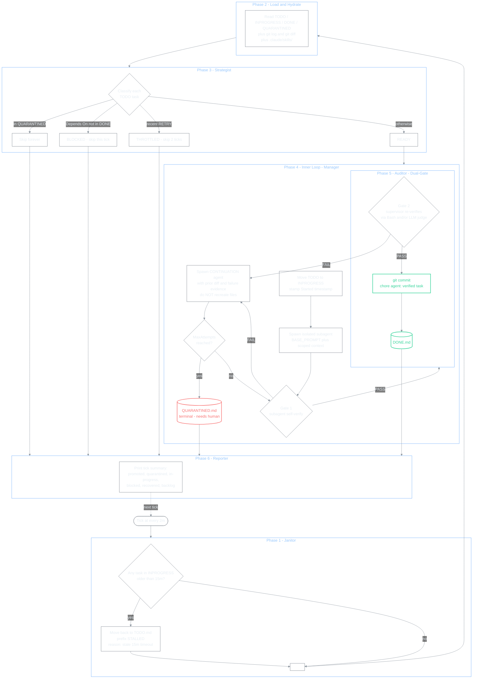

# Loop Engineering — Claude Code Kanban Plugin


**An autonomous, self-healing Kanban loop for Claude Code.** Drop tasks in markdown. Walk away. Watch verified work commit itself to git.

```
   ┌─────────────┐    ┌──────────────┐    ┌─────────────┐
   │   TODO.md   │ -> │ INPROGRESS   │ -> │   DONE.md   │
   │  backlog    │    │  + timer     │    │ + git comm. │
   └─────────────┘    └──────────────┘    └─────────────┘
           ^                  |                  |
           |    10m stale     |    Gate 1 + 2    |
           +------------------+------------------+
                  (auto-retry)        (auto-verify)
```

### One tick, in detail



**Reading the diagram:** every tick is six phases in order. The inner loop inside Phase 4 + 5 is where most of the work happens — a task that fails Gate 1 or Gate 2 doesn't bounce back to the backlog. Instead the supervisor spawns a *continuation agent* with the previous attempt's git diff in the working tree, so the next attempt builds on prior work instead of starting from scratch. Tasks only hit `QUARANTINED.md` when you (the human) move them there — the supervisor otherwise runs the inner loop indefinitely until Gate 2 passes or you `Ctrl+C`.

---

## Install globally + scaffold current project (one-time)

Paste this into Claude Code from inside the project you want Loop Engineering to run in. It installs the slash command globally (works in every project) AND scaffolds the state files (`TODO.md`, `INPROGRESS.md`, `DONE.md`, `QUARANTINED.md`) plus the local `.claude/commands/loop-tasks.md` in the current folder:

```text
Install Loop Engineering as a global Claude Code skill AND scaffold the state files in the current project folder. The source repo is https://github.com/AliSharjeell/LoopEngineering-ClaudeCode-Kanban-Plugin. The project folder is PROJECT_DIR=$(pwd) — the loop will run inside it.

1. Clone the repo to a temp directory:
   rm -rf /tmp/loop-engineering
   git clone https://github.com/AliSharjeell/LoopEngineering-ClaudeCode-Kanban-Plugin.git /tmp/loop-engineering

2. Install the slash command and skill entry globally:
   mkdir -p ~/.claude/skills/loop-tasks
   cp /tmp/loop-engineering/.claude/commands/loop-tasks.md ~/.claude/commands/loop-tasks.md
   cp /tmp/loop-engineering/.claude/commands/loop-tasks.md ~/.claude/skills/loop-tasks/SKILL.md

3. Copy the assets globally:
   mkdir -p ~/.claude/loop-engineering
   cp -r /tmp/loop-engineering/assets ~/.claude/loop-engineering/

4. Scaffold the state files and slash command in PROJECT_DIR (the folder you're running this prompt from):
   mkdir -p "$PROJECT_DIR/.claude/commands"
   cp /tmp/loop-engineering/.claude/commands/loop-tasks.md "$PROJECT_DIR/.claude/commands/loop-tasks.md"
   cp /tmp/loop-engineering/TODO.md        "$PROJECT_DIR/TODO.md"
   cp /tmp/loop-engineering/INPROGRESS.md  "$PROJECT_DIR/INPROGRESS.md"
   cp /tmp/loop-engineering/QUARANTINED.md "$PROJECT_DIR/QUARANTINED.md"
   # DONE.md is written fresh (the source repo file is misnamed DONE.MD; the slash command reads DONE.md lowercase).
   cat > "$PROJECT_DIR/DONE.md" <<'DONE_EOF'
# Done

> Verified and completed tasks. Each entry has cleared both Gate 1 (subagent self-verify) and Gate 2 (supervisor re-verify) and has been committed to git.
DONE_EOF

5. Clean up the temp clone:
   rm -rf /tmp/loop-engineering

6. Verify file install with:
   ls ~/.claude/commands/loop-tasks.md ~/.claude/skills/loop-tasks/SKILL.md
   ls "$PROJECT_DIR/.claude/commands/loop-tasks.md" "$PROJECT_DIR/TODO.md" "$PROJECT_DIR/INPROGRESS.md" "$PROJECT_DIR/DONE.md" "$PROJECT_DIR/QUARANTINED.md"

7. HUMAN-IN-THE-LOOP ONBOARDING — print this verbatim to me before doing anything else:

   "Loop Engineering is installed. Quick primer before we start:

    • GOOD tasks are atomic ('Add input validation to calculate() in utils.py'), have a binary Verification (a single bash command like `pytest tests/test_utils.py -q`), and finish in under ~15 minutes (the stale timeout).
    • BAD tasks are vague ('make it better', 'refactor auth'), have subjective verification ('looks good', 'feels right'), or are too large for one tick — those will spin the loop forever or quarantine.
    • You don't have to hand-edit TODO.md. Just say things like 'add a task to fix the null pointer in login.ts with verification `npm test -- login`' or 'add three tasks for the dark mode rollout, each with a Playwright screenshot check' — I'll write properly formatted blocks. If you describe a task vaguely, I will ask you for the missing Verification before writing it.
    • Verifications come in two flavors that you can mix in the same task: `Verification:` (a bash CLI command — exit 0 = pass; the most reproducible kind, use for unit tests, type checks, lints, smoke scripts, `curl | jq`, etc.) and `Verification-LLM:` (a strict rubric a read-only LLM judge evaluates against the git diff or a screenshot). For UI work, use BOTH — both gates must pass."

8. HUMAN-IN-THE-LOOP UI TOOLING — ask the user whether they want a visual verification tool wired up. Use the AskUserQuestion tool with these four options (do not assume — they pick):

   Question: "Want me to set up a UI verification tool for visual tasks? (Most projects are fine with CLI-only — skip if you're working on backend / library / CLI / infra.)"
   Header: "UI tooling"
   Options:
     • "cua-driver (desktop / Electron / native apps, Recommended for UI)" — cross-platform background computer-use automation, drives windows via the OS accessibility tree without stealing focus. Installed as an MCP server. I'll check if it's already registered; if not, I'll show you the install command and offer to register the MCP server in your Claude config (with your confirmation — I will not silently edit ~/.claude/settings.json).
     • "Playwright (web apps)" — headless browser automation for Chromium/Firefox/WebKit with built-in screenshot diffing. I'll detect your package manager (pnpm/yarn/npm) and offer to run `<pm> add -D @playwright/test && npx playwright install` in the background.
     • "OS-native screenshot only" — lightweight, zero-install fallback. I'll record the right capture command for your OS (`screencapture -x` on macOS, the cua-driver `screenshot` tool on Windows if available else PowerShell, `import -window root` on Linux/X11 — requires ImageMagick).
     • "Skip — CLI/bash verifications only" — the safest default for backend/library/CLI projects. You can re-run this install prompt later if you change your mind.

   Then act on the choice:
     - cua-driver: check whether mcp__cua-computer-use__* tools are present. If yes, confirm "already wired up." If no, print the cua-driver install one-liner from https://github.com/trycua/cua and ask via AskUserQuestion ("Want me to run the install now?") — only run it if the user agrees.
     - Playwright: detect package manager from lockfile (pnpm-lock.yaml → pnpm, yarn.lock → yarn, else npm). Ask ("Run `<pm> add -D @playwright/test && npx playwright install` now?") — if yes, run in background via Bash with run_in_background:true and surface the task ID.
     - Screenshot-only: detect the OS, print the right capture command, and tell the user to use it inside `Verification:` blocks or via `Verification-LLM:` rubrics that reference the captured PNG.
     - Skip: just confirm and move on.

   Record the chosen UI tool inline in PROJECT_DIR/.loop-tasks-config.md so subsequent installs see it:
     cat > "$PROJECT_DIR/.loop-tasks-config.md" <<CONFIG_EOF
   # loop-tasks config (informational — the supervisor does not require this file)
   UI Tool: <one of: cua-driver | playwright | screenshot | none>
   Package Manager: <npm | pnpm | yarn | n/a>
   Screenshot Command: <only if UI Tool == screenshot>
   OS: <darwin | win32 | linux>
   Initialized: <ISO8601 timestamp>
   CONFIG_EOF

9. Final message — print this verbatim:

   "Three ways to start:
    1. Tell me a task in natural language — 'add a task to fix the typo in README.md' — I'll write the block.
    2. Edit TODO.md directly using the schema at the top of that file.
    3. Run `/loop 2m /loop-tasks` when you have at least one task. Use 5m for active dev, 30m–1h for cheap background work.

    The supervisor retries the inner loop until Verification passes (or MaxAttempts is hit, if you set one). Stop anytime with Ctrl+C — state is on disk, nothing is lost."

After install, /loop-tasks works in every project. To update, re-run these steps. The current project at PROJECT_DIR is now ready — add tasks to PROJECT_DIR/TODO.md (or ask me to) and run /loop 2m /loop-tasks from inside it.
```

## What it does

Loop Engineering turns Claude Code's `/loop` into a verified task factory:

- You write tasks in `TODO.md` with a clear description and a testable verification.
- Every 2 minutes, a supervisor reads your backlog, dispatches ready tasks to isolated subagents, verifies their work through two independent gates, commits verified work to git, and recovers any task whose subagent crashed.
- It runs forever. You stop it with `Ctrl+C`. State lives on disk in three markdown files.

That's the whole system. No servers. No daemons. No frameworks. One slash command + three state files + git.

---

## Quick start

```bash
# 1. Initialize git in your project (the safety net)
cd my-project
git init && git add . && git commit -m "initial"

# 2. Copy the LoopEngineering scaffold
cp -r path/to/LoopEngineering/.claude ./
cp -r path/to/LoopEngineering/assets ./

# 3. Open Claude Code in the project
claude

# 4. Confirm /loop-tasks appears in the slash menu (type / to check)

# 5. Add a task to TODO.md (use the schema in "Task schema" below)

# 6. Start the loop
/loop 2m /loop-tasks
```

Every two minutes the supervisor wakes up, processes your backlog, verifies the work, and commits verified tasks to git. Watch the terminal for the tick summary.

---

## How to use

This is the reference for every workflow the loop supports.

### First-time setup (once per project)

```bash
# Copy the scaffold
cp -r path/to/LoopEngineering/.claude my-project/
cp -r path/to/LoopEngineering/assets my-project/

# Initialize git
cd my-project
git init
git add .
git commit -m "chore: add LoopEngineering scaffold"

# Open Claude Code
claude
```

In Claude Code, type `/` in an empty prompt. You should see `/loop-tasks` in the menu. If you don't, check that `.claude/commands/loop-tasks.md` exists at the project root and restart Claude Code.

### Your first task

Add this to `TODO.md`:

```markdown
- [ ] Task: Add a hello-world script
  Verification: `node hello.js` prints `Hello, world!` to stdout and exits 0
  Depends On: none
```

Then in Claude Code:

```
/loop 2m /loop-tasks
```

Wait two minutes. The supervisor will:

1. Find your task in `TODO.md`.
2. Move it to `INPROGRESS.md` with a `Started:` timestamp.
3. Spawn a subagent to write `hello.js`.
4. Re-run `node hello.js` itself for Gate 2 verification.
5. Move the task to `DONE.md` and commit to git.

You'll see a tick summary like:

```
── Tick @ 2026-06-17T12:34:56Z ──
  Promoted to DONE: 1
  Still In Progress: 0
  Blocked: 0
  Recovered (stale): 0
  Backlog: 0
```

### Adding more work

Drop new tasks into `TODO.md` at any time. The loop picks them up on the next tick. See **Task schema** below for the full format with examples.

### Reading the tick summary

| Field | Meaning |
|-------|---------|
| `Promoted to DONE` | Tasks that passed both gates and are now in `DONE.md`. |
| `Still In Progress` | Tasks a subagent is currently working on (or verifying). |
| `Blocked` | Tasks whose `Depends On:` chain is not yet complete. The loop will not touch them. |
| `Recovered (stale)` | Tasks that exceeded the 15-minute timeout and were sent back to `TODO.md` as `[RETRY]`. |
| `Backlog` | Total tasks remaining in `TODO.md`. |

### Visual / image-based tasks

For UI work, mockup fidelity, or design-system conformance, attach an image to the verification. Subagents and the supervisor's LLM judge can read images via the `Read` tool.

```markdown
- [ ] Task: Refactor the dashboard hero to match the v2 mockup
  Verification-LLM: Read both `git diff HEAD` and the mockup at `assets/mockups/dashboard-hero-v2.png`. The implementation must match: (1) headline top-left with 48px margin, (2) CTA at bottom-right with primary brand color, (3) gradient stops at the mockup's angles. Reject if any visual mismatch is obvious.
  Depends On: none
```

Put reference images in `assets/mockups/`, baselines in `assets/baselines/`, references in `assets/references/`, brand assets in `assets/brand/`. Track them in git — they're the source of truth that verifications depend on.

For cheap "is the file on disk" checks, use bash instead:

```markdown
- [ ] Task: Add the dashboard hero illustration
  Verification: `test -f assets/illustrations/hero.svg && file assets/illustrations/hero.svg | grep -q "SVG"` exits 0
  Depends On: none
```

### Tasks that need judgment (LLM verification)

For architectural or aesthetic work that bash can't capture, use `Verification-LLM:` instead of `Verification:`. The supervisor spawns a read-only LLM judge to evaluate the diff against your rubric.

```markdown
- [ ] Task: Refactor the dashboard sidebar to a Linear-style minimalist hierarchy
  Verification-LLM: Read the diff. The sidebar must: (1) use 12px font with reduced contrast for secondary items, (2) collapse to icon-only at <768px viewport, (3) include ARIA labels on all interactive elements. Reject if any check is missing.
  Depends On: none
```

You can combine both: a bash check **and** an LLM rubric. Both must pass.

### Tasks that loop forever (by design)

If Gate 2 fails, the supervisor retries within the same tick — over and over, until it passes or you `Ctrl+C`. The dirty working tree is preserved across attempts so a continuation agent can build on prior work instead of starting from scratch. This is the point of the loop: it loops infinitely until success or human intervention.

### Tasks that get stuck (quarantine)

The supervisor never moves a task to `QUARANTINED.md` on its own — the inner loop runs forever. If you decide a task is structurally stuck (bad verification, missing dep, runaway cost), move the block from `INPROGRESS.md` to `QUARANTINED.md` yourself. The supervisor treats quarantined tasks as terminal and will never re-dispatch them.

To recover a quarantined task:

1. Read the attempt history in `QUARANTINED.md` to diagnose.
2. Clean the dirty working tree: `git checkout -- <files>` or `git stash`.
3. Move the task back to `TODO.md` with a `[RETRY]` prefix and (optionally) a rewritten verification.
4. Commit the recovery.

The `[RETRY]` prefix tells the supervisor to throttle the task — skip it for 2 ticks to prevent thrashing.

### Complex epics (use GSD first)

Loop Engineering is a factory line for execution. It assumes tasks are well-shaped: clear verification, concrete dependencies, scope under 15 minutes.

If you have an epic like "Build user authentication," do NOT drop it into `TODO.md`. The loop will get stuck.

Instead:

1. Use a planner (e.g., `/gsd:plan-phase <n>`) to decompose the epic into micro-tasks.
2. Translate those micro-tasks into Loop Engineering task blocks.
3. Drop them into `TODO.md` and start `/loop 2m /loop-tasks`.

The loop handles execution. External planners handle decomposition.

### Auto-generating TODO.md with Claude Code

Don't hand-write every task. Ask Claude Code to read your spec, codebase, or mockup and produce a well-shaped `TODO.md`.

From a spec doc:
```
Read SPEC.md and produce TODO.md with 8-15 tasks that fully implement it.
Follow the schema at the top of TODO.md exactly. Each task needs a
binary Verification. Order tasks as a DAG: foundation → features → polish.
```

From an existing codebase:
```
Look at this repo and produce TODO.md with 5-10 tasks that would
meaningfully improve it (missing tests, TODO comments, lint warnings,
deprecation notices). Reference specific file paths in each Task:.
```

From a design mockup:
```
Look at assets/mockups/main.png and produce TODO.md with the
implementation tasks needed to build it. Use Verification-LLM: with
rubric referencing the mockup for any primarily-visual task.
```

Then iterate: "Reorder so auth tasks come before dashboard tasks. Rewrite the verification for X to test success not just rendering. Split Y into 3 smaller tasks."

### Daily operations

| You want to... | Do this |
|----------------|---------|
| Edit a task that's running | Move it back to `TODO.md` first, edit there. Never edit `INPROGRESS.md` by hand. |
| Skip a task for now | Add `[SKIP]` to the `Task:` line. Remove it to re-enable. |
| Force-retry a stuck task | Remove from `INPROGRESS.md`, put back at the top of `TODO.md` with the `[RETRY]` prefix removed. |
| Revert a bad commit | `git reset --hard HEAD~1`. State files roll back too. |
| Stop the loop | `Ctrl+C` in the terminal where `/loop` is running. State is on disk; nothing is lost. |
| Resume the loop | Re-run `/loop 2m /loop-tasks`. |
| Change the cadence | `/loop 5m /loop-tasks` (every 5 min) or `/loop 30s /loop-tasks` (every 30s). |
| Change the stale timeout | Edit `.claude/commands/loop-tasks.md`, find `> 15 minutes`, change it. |

---

## Architecture

The whole system in one diagram:

```
   ┌─────────────┐    ┌──────────────┐    ┌─────────────┐
   │   TODO.md   │ -> │ INPROGRESS   │ -> │   DONE.md   │
   │  backlog    │    │  + timer     │    │ + git comm. │
   └─────────────┘    └──────────────┘    └─────────────┘
           ^                  |                  |
           |    15m stale     |    Gate 1 + 2    |
           +------------------+------------------+
                  (auto-retry)        (auto-verify)
                            |
                            v
                     QUARANTINED.md
                  (terminal failure, needs human)
```

### The 3-file Kanban

| File | Owned by | Purpose |
|------|----------|---------|
| `TODO.md` | you | Pending tasks with `Task:`, `Verification:`, `Depends On:` |
| `INPROGRESS.md` | supervisor | Active tasks with `Started:` timestamp |
| `DONE.md` | supervisor | Verified, git-committed tasks (append-only) |
| `QUARANTINED.md` | supervisor | Terminal failure state, never re-dispatched |

The supervisor reads `TODO.md` and `DONE.md` to compute the dependency graph. It moves tasks through the states itself. You only edit `TODO.md` (input) and `QUARANTINED.md` (recovery).

### One tick = 6 phases

Every 2 minutes, `/loop-tasks` runs these in order:

1. **Stale Recovery (Janitor)** — sweep `INPROGRESS.md`. Any task older than 15 minutes gets yanked back to `TODO.md` as `[RETRY]`. Crashed subagents are healed automatically.
2. **Load State** — read all four state files + `git log` for context hydration.
3. **Classify (Strategist)** — label each task BLOCKED (deps not done), THROTTLED (failed in last 2 ticks), or READY.
4. **Dispatch with Inner Loop (Manager)** — for each READY task: move to `INPROGRESS.md`, spawn isolated subagent, retry indefinitely within this tick until Gate 2 passes.
5. **Dual-Gate Audit (Auditor)** — subagent self-verifies (Gate 1). Supervisor re-runs the verification itself (Gate 2). Both must pass. If Gate 2 fails, the task re-enters the inner loop with the failure as context.
6. **Tick Summary (Reporter)** — print one block to stdout. Numbers only.

### Why two gates?

A subagent can hallucinate success, skip verification, or misinterpret the task. Gate 2 is the supervisor independently re-running the verification with its own tools. Both must agree, and Gate 2 has the final word. The cost is a second execution; the benefit is the difference between "shipped verified work" and "shipped plausible work."

### Inner loop (continuation agents)

When a subagent fails, the supervisor does NOT kick the task back to the backlog for a fresh start. It spawns a **continuation agent** with:
- The full task description and verification.
- The previous attempt's failure evidence.
- The previous attempt's edits still in the working tree (`git diff`).
- An explicit warning: do not recreate files, apply targeted patches.

This means a task that fails on attempt 2 doesn't pay the cost of a new subagent discovering the codebase from scratch, or losing partial work. Each retry builds on the prior attempt's state.

Tasks that pass first try go straight through with no spawn overhead.

### Context hydration

Each subagent gets scoped context — recent commits and diffs filtered to the file paths mentioned in the task. Tasks with no path hints hydrate from the whole repo (use sparingly on large repos).

### What's not here

Deliberately omitted:
- Inter-subagent communication (subagents see only their own task; findings land on the filesystem)
- An automatic improver (you watch tick summaries and tune verifications over time)
- Cross-task learning (each tick is stateless — same instructions, fresh read)
- True parallelism (Agent calls run sequentially in batch; real parallelism needs separate sessions)

---

## Task schema

Every task in `TODO.md` must follow this format exactly. The supervisor parses it line-by-line.

```markdown
- [ ] Task: <short, imperative description>
  Verification: <concrete, binary test>            # optional if Verification-LLM present
  Verification-LLM: <rubric for judgment>         # optional, for visual/architectural
  MaxAttempts: <N>                                # optional cap; default is unlimited
  Depends On: <none | exact Task: string>
```

### Good examples

```markdown
- [ ] Task: Add a health-check endpoint to the API
  Verification: `curl localhost:3000/health` returns `{"status":"ok"}` with HTTP 200
  Depends On: none

- [ ] Task: Write a Jest test for the health-check endpoint
  Verification: `npm test -- health.test.js` exits 0 and "1 passed" appears in stdout
  Depends On: Add a health-check endpoint to the API
```

### Bad examples (will fail)

- ❌ "Make the login work" — vague, not testable
- ❌ "Verify the API looks good" — subjective
- ❌ `Depends on the "Add endpoint" task` — must character-match the exact `Task:` string
- ❌ `Verification: works correctly` — no command, no assertion

**The verification rule:** if a human can't run a single bash command and get a pass/fail answer in 10 seconds, rewrite the verification.

---

## File layout

```
LoopEngineering/
├── .claude/
│   └── commands/
│       └── loop-tasks.md     # the /loop-tasks slash command
├── assets/
│   ├── architecture.png      # tick-flow diagram
│   ├── mockups/              # design references for visual tasks
│   ├── baselines/            # visual regression baselines
│   ├── references/           # reference screenshots
│   └── brand/                # logos, brand assets
├── .gitignore                # OS/editor/build exclusions
├── HOW-IT-WORKS.md           # technical deep-dive
├── PLAN.md                   # architecture + design rationale
├── QUARANTINED.md            # terminal failure state
├── README.md                 # this file
├── TODO.md                   # pending tasks (your input)
├── INPROGRESS.md             # active tasks (supervisor-owned)
└── DONE.md                   # verified completed tasks
```

---

## Configuration

**Tick interval:** `/loop 5m /loop-tasks` (5 min) or `/loop 30s /loop-tasks` (30s). Shorter = more responsive but more context churn. 2 min is the default.

**Stale timeout:** edit `.claude/commands/loop-tasks.md`, find `> 15 minutes`, change it. Keep it well below the tick interval so the janitor runs at least once between starts.

**Custom verification runners:** put any test command (pytest, jest, go test) directly in the `Verification:` line. The supervisor will execute it via `Bash` during Gate 2.

**Stale timeout units:** the slash command uses minutes. The default is 15 — long enough for non-trivial tasks, short enough that a crashed subagent doesn't block the queue.

---

## Troubleshooting

**`/loop-tasks` not in the slash menu**
Check that `.claude/commands/loop-tasks.md` exists at the project root and restart Claude Code.

**Tick runs but nothing happens**
`TODO.md` is empty, or all tasks are BLOCKED. Check `Depends On:` strings for typos.

**Tasks keep timing out at 15 minutes**
Split them. Tasks that take longer than one tick to verify are too big.

**Gate 2 keeps disagreeing with Gate 1**
Tighten the verification statement. The supervisor is doing its job.

**`git commit` fails in Phase 5**
Either the repo isn't a git repo (run `git init`), or there are no changes to commit. Both are non-fatal — the task is still moved to DONE.

**Tasks keep cycling between [RETRY] and INPROGRESS**
The verification statement is ambiguous. Read the fail reasons, tighten the verification, drop `MaxAttempts` to make the loop stop thrashing.

**Subagent produced a huge dirty tree that blocks subsequent tasks**
Run `git checkout -- <files>` or `git stash` to clean the working tree, then add `[RETRY]` to the task in `TODO.md` to force redispatch.

---

## Limitations

1. **Subagent parallelism is fake.** Within a single Claude Code session, Agent calls run sequentially in a batch. True parallel execution requires separate shell-spawned sessions.
2. **No inter-subagent communication.** Subagents only see their own task. Findings must land on the filesystem.
3. **Context drift over very long sessions.** Even with the structured phase model, multi-day sessions degrade. Restart Claude Code daily.
4. **Verification is only as good as the statement.** Vague verifications pass on garbage work.
5. **`/loop` expires after ~3 days.** Re-run `/loop 2m /loop-tasks` periodically to keep the factory running.

See `HOW-IT-WORKS.md` for the full technical deep-dive and `PLAN.md` for the design rationale.

---

## License

MIT. Use it, fork it, ship it.
